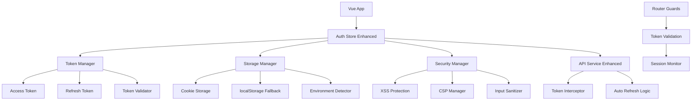
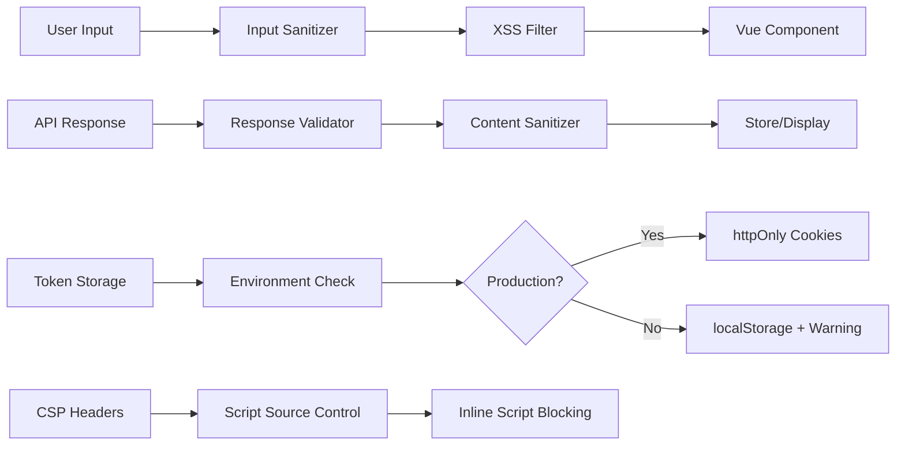

# Authentication Security Enhancements Design

## Overview

This design document outlines the implementation of comprehensive security enhancements for the existing Vue.js authentication system. The solution transforms the current localStorage-based token system into a production-ready, secure authentication framework that addresses XSS vulnerabilities, implements token refresh mechanisms, and provides secure storage options while maintaining backward compatibility and user experience.

## Architecture

### High-Level Architecture



### Security Layer Architecture



## Components and Interfaces

### 1. Enhanced Authentication Store

**File:** `src/stores/auth.ts`

**Key Enhancements:**

- Token refresh logic with automatic retry
- Secure storage management
- XSS protection integration
- Session monitoring and validation

**New Methods:**

```typescript
interface AuthStoreEnhanced {
  // Token Management
  refreshToken(): Promise<boolean>
  validateToken(token: string): boolean
  scheduleTokenRefresh(): void

  // Security
  sanitizeUserData(data: any): any
  detectXSSAttempt(input: string): boolean

  // Storage Management
  getSecureStorage(): StorageInterface
  migrateFromLegacyStorage(): Promise<void>

  // Session Management
  extendSession(): Promise<boolean>
  terminateAllSessions(): Promise<void>
  getSessionInfo(): SessionInfo
}
```

### 2. Token Manager Service

**File:** `src/services/tokenManager.ts`

**Responsibilities:**

- Access and refresh token lifecycle management
- Automatic token refresh scheduling
- Token validation and parsing
- Cross-tab synchronization

**Interface:**

```typescript
interface TokenManager {
  setTokens(accessToken: string, refreshToken: string): void
  getAccessToken(): string | null
  getRefreshToken(): string | null
  isTokenExpired(token: string): boolean
  refreshAccessToken(): Promise<TokenRefreshResult>
  scheduleRefresh(token: string): void
  clearTokens(): void
  validateTokenStructure(token: string): boolean
}

interface TokenRefreshResult {
  success: boolean
  accessToken?: string
  refreshToken?: string
  error?: string
}
```

### 3. Secure Storage Manager

**File:** `src/services/storageManager.ts`

**Responsibilities:**

- Environment-aware storage selection
- Cookie management with security flags
- localStorage fallback for development
- Data encryption/decryption

**Interface:**

```typescript
interface StorageManager {
  setItem(key: string, value: string, options?: StorageOptions): void
  getItem(key: string): string | null
  removeItem(key: string): void
  clear(): void
  isSecureEnvironment(): boolean
  migrateData(fromStorage: Storage, toStorage: Storage): Promise<void>
}

interface StorageOptions {
  httpOnly?: boolean
  secure?: boolean
  sameSite?: 'strict' | 'lax' | 'none'
  maxAge?: number
  domain?: string
}
```

### 4. XSS Protection Service

**File:** `src/services/xssProtection.ts`

**Responsibilities:**

- Input sanitization and validation
- Content Security Policy management
- XSS attempt detection and logging
- Safe HTML rendering utilities

**Interface:**

```typescript
interface XSSProtection {
  sanitizeInput(input: string): string
  sanitizeHTML(html: string): string
  validateInput(input: string, type: InputType): ValidationResult
  detectMaliciousContent(content: string): boolean
  setupCSP(): void
  logSecurityEvent(event: SecurityEvent): void
}

enum InputType {
  TEXT = 'text',
  EMAIL = 'email',
  HTML = 'html',
  URL = 'url',
}
```

### 5. Enhanced API Service

**File:** `src/services/api.ts` (Enhanced)

**New Features:**

- Automatic token refresh on 401 responses
- Request queuing during token refresh
- Security header management
- Response validation

**Enhanced Methods:**

```typescript
interface APIServiceEnhanced extends APIService {
  setupInterceptors(): void
  queueRequest(request: RequestConfig): Promise<any>
  processQueuedRequests(): void
  validateResponse(response: any): boolean
  addSecurityHeaders(headers: Headers): Headers
}
```

## Data Models

### Token Structure

```typescript
interface TokenPair {
  accessToken: string // Short-lived (15-30 minutes)
  refreshToken: string // Long-lived (7-30 days)
  tokenType: 'Bearer'
  expiresIn: number // Access token expiration in seconds
  refreshExpiresIn: number // Refresh token expiration in seconds
}

interface DecodedToken {
  sub: string // User ID
  email: string
  userType: string
  iat: number // Issued at
  exp: number // Expires at
  jti: string // JWT ID for tracking
}
```

### Session Information

```typescript
interface SessionInfo {
  sessionId: string
  userId: string
  deviceInfo: DeviceInfo
  loginTime: Date
  lastActivity: Date
  expiresAt: Date
  isActive: boolean
}

interface DeviceInfo {
  userAgent: string
  ipAddress: string
  location?: string
  deviceType: 'desktop' | 'mobile' | 'tablet'
}
```

### Security Event

```typescript
interface SecurityEvent {
  type: SecurityEventType
  timestamp: Date
  userId?: string
  sessionId?: string
  details: any
  severity: 'low' | 'medium' | 'high' | 'critical'
}

enum SecurityEventType {
  XSS_ATTEMPT = 'xss_attempt',
  TOKEN_TAMPERING = 'token_tampering',
  SUSPICIOUS_LOGIN = 'suspicious_login',
  MULTIPLE_FAILED_ATTEMPTS = 'multiple_failed_attempts',
  TOKEN_REFRESH_FAILED = 'token_refresh_failed',
}
```

## Error Handling

### Token Refresh Error Handling

```typescript
enum TokenRefreshError {
  REFRESH_TOKEN_EXPIRED = 'refresh_token_expired',
  REFRESH_TOKEN_INVALID = 'refresh_token_invalid',
  NETWORK_ERROR = 'network_error',
  SERVER_ERROR = 'server_error',
  RATE_LIMITED = 'rate_limited',
}

interface ErrorHandlingStrategy {
  [TokenRefreshError.REFRESH_TOKEN_EXPIRED]: () => void // Logout user
  [TokenRefreshError.REFRESH_TOKEN_INVALID]: () => void // Clear tokens, redirect to login
  [TokenRefreshError.NETWORK_ERROR]: () => void // Retry with exponential backoff
  [TokenRefreshError.SERVER_ERROR]: () => void // Show error message, allow manual retry
  [TokenRefreshError.RATE_LIMITED]: () => void // Wait and retry
}
```

### XSS Protection Error Handling

```typescript
interface XSSErrorHandling {
  onMaliciousContentDetected(content: string, source: string): void
  onCSPViolation(violation: CSPViolation): void
  onSanitizationFailure(input: string, error: Error): void
}
```

## Testing Strategy

### Unit Testing

1. **Token Manager Tests**

   - Token validation logic
   - Refresh scheduling
   - Cross-tab synchronization
   - Error handling scenarios

2. **Storage Manager Tests**

   - Environment detection
   - Cookie security flags
   - Data migration
   - Fallback mechanisms

3. **XSS Protection Tests**
   - Input sanitization
   - Malicious content detection
   - CSP policy enforcement
   - HTML sanitization

### Integration Testing

1. **Authentication Flow Tests**

   - Login with token refresh
   - Automatic token renewal
   - Session expiration handling
   - Multi-tab synchronization

2. **Security Tests**
   - XSS attack prevention
   - Token tampering detection
   - CSP violation handling
   - Secure storage verification

### End-to-End Testing

1. **User Journey Tests**

   - Complete authentication flow
   - Session management across page refreshes
   - Token refresh during API calls
   - Logout and cleanup

2. **Security Scenario Tests**
   - XSS attack simulation
   - Token manipulation attempts
   - Network interruption handling
   - Browser security feature testing

## Implementation Phases

### Phase 1: Core Security Infrastructure

- XSS Protection Service implementation
- Content Security Policy setup
- Input sanitization framework
- Security event logging

### Phase 2: Token Management Enhancement

- Token Manager service
- Refresh token logic
- Automatic renewal scheduling
- Cross-tab synchronization

### Phase 3: Secure Storage Implementation

- Storage Manager service
- Environment detection
- Cookie-based storage for production
- Migration utilities

### Phase 4: API Integration and Testing

- Enhanced API service with interceptors
- Request queuing during refresh
- Comprehensive testing suite
- Performance optimization

### Phase 5: Monitoring and Analytics

- Security event dashboard
- Session analytics
- Performance monitoring
- User experience metrics

## Security Considerations

### Content Security Policy

```typescript
const CSP_POLICY = {
  'default-src': ["'self'"],
  'script-src': ["'self'", "'unsafe-eval'"], // Remove unsafe-eval in production
  'style-src': ["'self'", "'unsafe-inline'"], // Minimize unsafe-inline usage
  'img-src': ["'self'", 'data:', 'https:'],
  'connect-src': ["'self'", 'https://api.yourdomain.com'],
  'font-src': ["'self'"],
  'object-src': ["'none'"],
  'base-uri': ["'self'"],
  'form-action': ["'self'"],
}
```

### Cookie Security Configuration

```typescript
const COOKIE_CONFIG = {
  httpOnly: true,
  secure: process.env.NODE_ENV === 'production',
  sameSite: 'strict' as const,
  maxAge: 7 * 24 * 60 * 60 * 1000, // 7 days for refresh token
  domain: process.env.COOKIE_DOMAIN,
  path: '/',
}
```

### Token Security

- Access tokens: 15-30 minute expiration
- Refresh tokens: 7-30 day expiration with rotation
- JWT signing with RS256 algorithm
- Token binding to session and device fingerprint
- Automatic token rotation on refresh

This design provides a comprehensive security enhancement while maintaining usability and backward compatibility. The modular approach allows for incremental implementation and testing of each security feature.
