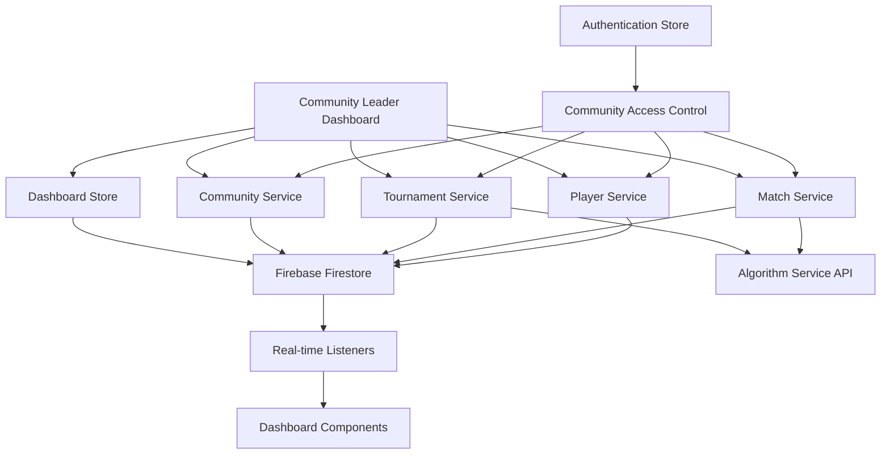

# Community Leader Dashboard Design Document

## Overview

The Community Leader Dashboard enhances the existing Vue.js community management interface by integrating advanced tournament management capabilities from the admin system. The design extends the current Dashboard.vue component and community store to include tournament oversight, match management, and player analytics while maintaining the existing authentication, security services, and UI components. The enhanced dashboard provides seamless integration between community management and tournament operations within the established project architecture.

## Architecture

### High-Level Architecture



### Component Integration Strategy

**Enhanced Dashboard.vue (existing component)**

```
Dashboard.vue (enhanced)
├── Existing Community Stats Cards (enhanced)
│   ├── Total Communities Card (existing)
│   ├── Total Members Card (existing)
│   ├── Tournament Stats Card (new)
│   └── Match Activity Card (new)
├── Enhanced Quick Actions (existing + new)
│   ├── Manage Communities (existing)
│   ├── Add Members (existing)
│   ├── Tournament Management (new)
│   └── Match Oversight (new)
├── Tournament Overview Panel (new)
│   ├── TournamentCard.vue
│   ├── TournamentStatusIndicator.vue
│   └── RoundProgressIndicator.vue
├── Active Matches Panel (new)
│   ├── MatchCard.vue
│   ├── MatchStatusBadge.vue
│   └── MatchFilterControls.vue
├── Enhanced Community Overview (existing + tournament data)
│   ├── Community Cards (existing)
│   ├── Tournament Integration (new)
│   └── Player Performance Metrics (new)
└── Recent Activity (enhanced with tournament events)
    ├── Community Activity (existing)
    ├── Tournament Events (new)
    └── Match Results (new)
```

## Components and Interfaces

### Core Dashboard Component

**CommunityLeaderDashboard.vue**

- Main container component that orchestrates all dashboard sections
- Manages global dashboard state and real-time data subscriptions
- Handles community-level access control and data filtering
- Provides responsive layout with collapsible sections

### Data Service Layer

**CommunityDashboardService**

```typescript
interface CommunityDashboardService {
  // Core data fetching
  getCommunityOverview(communityId: string): Promise<CommunityOverview>
  getTournaments(communityId: string): Promise<Tournament[]>
  getMatches(communityId: string, filters?: MatchFilters): Promise<Match[]>
  getPlayers(communityId: string): Promise<Player[]>
  getStatistics(communityId: string, dateRange?: DateRange): Promise<CommunityStats>

  // Real-time subscriptions
  subscribeToCommunityData(
    communityId: string,
    callback: (data: CommunityData) => void,
  ): Unsubscribe
  subscribeToTournaments(
    communityId: string,
    callback: (tournaments: Tournament[]) => void,
  ): Unsubscribe
  subscribeToMatches(communityId: string, callback: (matches: Match[]) => void): Unsubscribe

  // Tournament control
  generateNextRound(tournamentId: string): Promise<RoundGenerationResult>
  finalizeTournament(tournamentId: string): Promise<TournamentFinalizationResult>

  // Analytics and reporting
  generateAnalytics(communityId: string, options: AnalyticsOptions): Promise<AnalyticsData>
  exportData(communityId: string, format: ExportFormat): Promise<ExportResult>
}
```

### State Management

**Community Dashboard Store (Pinia)**

```typescript
interface CommunityDashboardStore {
  // State
  communityId: string | null
  overview: CommunityOverview | null
  tournaments: Tournament[]
  matches: Match[]
  players: Player[]
  statistics: CommunityStats | null
  notifications: Notification[]
  loading: LoadingState
  error: ErrorState | null

  // Computed
  activeTournaments: Tournament[]
  pendingMatches: Match[]
  completedMatches: Match[]
  topPlayers: Player[]
  canGenerateNextRound: boolean
  canFinalizeTournaments: boolean

  // Actions
  initializeDashboard(communityId: string): Promise<void>
  refreshData(): Promise<void>
  updateMatchResult(matchId: string, result: MatchResult): Promise<void>
  advanceTournamentRound(tournamentId: string): Promise<void>
  finalizeTournament(tournamentId: string): Promise<void>
  dismissNotification(notificationId: string): void
  exportCommunityData(format: ExportFormat): Promise<void>
}
```

## Data Models

### Community Overview

```typescript
interface CommunityOverview {
  communityId: string
  communityName: string
  totalTournaments: number
  activeTournaments: number
  totalPlayers: number
  activePlayers: number
  totalMatches: number
  completedMatches: number
  pendingMatches: number
  lastActivity: Date
  performanceMetrics: {
    tournamentCompletionRate: number
    averageMatchDuration: number
    playerParticipationRate: number
  }
}
```

### Tournament Data

```typescript
interface CommunityTournament extends Tournament {
  communityId: string
  currentRound: string
  roundProgress: {
    current: number
    total: number
    percentage: number
  }
  matchesStatus: {
    total: number
    completed: number
    pending: number
    inProgress: number
  }
  canAdvanceRound: boolean
  canFinalize: boolean
  nextRoundReady: boolean
}
```

### Match Data

```typescript
interface CommunityMatch extends Match {
  communityId: string
  tournamentName: string
  roundName: string
  statusColor: 'red' | 'yellow' | 'green'
  requiresAttention: boolean
  lastUpdated: Date
  estimatedDuration: number
}
```

### Player Data

```typescript
interface CommunityPlayer extends Player {
  communityId: string
  registrationDate: Date
  tournamentHistory: TournamentParticipation[]
  performanceMetrics: {
    winRate: number
    averageScore: number
    tournamentsPlayed: number
    currentRanking: number
  }
  status: 'active' | 'inactive' | 'suspended'
}
```

### Statistics and Analytics

```typescript
interface CommunityStats {
  communityId: string
  dateRange: DateRange
  tournaments: {
    total: number
    completed: number
    ongoing: number
    upcoming: number
    completionRate: number
  }
  matches: {
    total: number
    completed: number
    pending: number
    averageDuration: number
  }
  players: {
    total: number
    active: number
    newRegistrations: number
    participationRate: number
  }
  trends: {
    tournamentGrowth: TrendData[]
    playerGrowth: TrendData[]
    matchCompletionRate: TrendData[]
  }
}
```

## Error Handling

### Error Categories

1. **Authentication Errors**: Invalid community access, expired sessions
2. **Data Fetching Errors**: Network issues, Firestore connection problems
3. **Algorithm Service Errors**: Tournament progression failures, API timeouts
4. **Validation Errors**: Invalid match results, tournament state conflicts
5. **Permission Errors**: Unauthorized actions, cross-community access attempts

### Error Handling Strategy

```typescript
interface ErrorHandler {
  handleAuthenticationError(error: AuthError): void
  handleDataFetchError(error: DataError): void
  handleAlgorithmError(error: AlgorithmError): void
  handleValidationError(error: ValidationError): void
  handlePermissionError(error: PermissionError): void

  // User-friendly error messages
  getErrorMessage(error: Error): string
  getRecoveryActions(error: Error): RecoveryAction[]
}
```

## Testing Strategy

### Unit Testing

- **Service Layer**: Test all CRUD operations and data transformations
- **Store Logic**: Test state mutations and computed properties
- **Utility Functions**: Test data filtering, sorting, and formatting functions
- **Component Logic**: Test component methods and computed properties

### Integration Testing

- **Firebase Integration**: Test real-time listeners and data synchronization
- **Algorithm Service**: Test tournament progression and match generation
- **Authentication Flow**: Test community access control and role validation
- **Cross-Component Communication**: Test data flow between components

### End-to-End Testing

- **Dashboard Loading**: Test complete dashboard initialization
- **Tournament Management**: Test full tournament lifecycle
- **Match Management**: Test match completion and result submission
- **Real-time Updates**: Test live data synchronization across multiple sessions

### Performance Testing

- **Data Loading**: Test dashboard performance with large datasets
- **Real-time Updates**: Test performance with frequent data changes
- **Memory Usage**: Test for memory leaks in long-running sessions
- **Network Efficiency**: Test data fetching optimization and caching

## Security Considerations

### Access Control

- **Community Isolation**: Ensure users can only access their community data
- **Role-Based Permissions**: Validate community leader permissions for all operations
- **Data Filtering**: Apply community-level filters at the service layer
- **Audit Logging**: Track all administrative actions for compliance

### Data Protection

- **Input Validation**: Sanitize all user inputs and form data
- **XSS Prevention**: Use existing XSS protection service for dynamic content
- **CSRF Protection**: Implement CSRF tokens for state-changing operations
- **Secure Communication**: Ensure all API calls use HTTPS and proper authentication

## Performance Optimization

### Data Fetching

- **Lazy Loading**: Load dashboard sections on demand
- **Pagination**: Implement pagination for large datasets (matches, players)
- **Caching**: Cache frequently accessed data with appropriate TTL
- **Batch Operations**: Group related API calls to reduce network overhead

### Real-time Updates

- **Selective Subscriptions**: Only subscribe to relevant data changes
- **Debounced Updates**: Prevent excessive UI updates from rapid data changes
- **Connection Management**: Handle network disconnections gracefully
- **Memory Management**: Clean up listeners and subscriptions properly

### UI Performance

- **Virtual Scrolling**: For large lists of matches or players
- **Component Memoization**: Prevent unnecessary re-renders
- **Image Optimization**: Lazy load and optimize player avatars and charts
- **Bundle Splitting**: Code-split dashboard components for faster initial load
